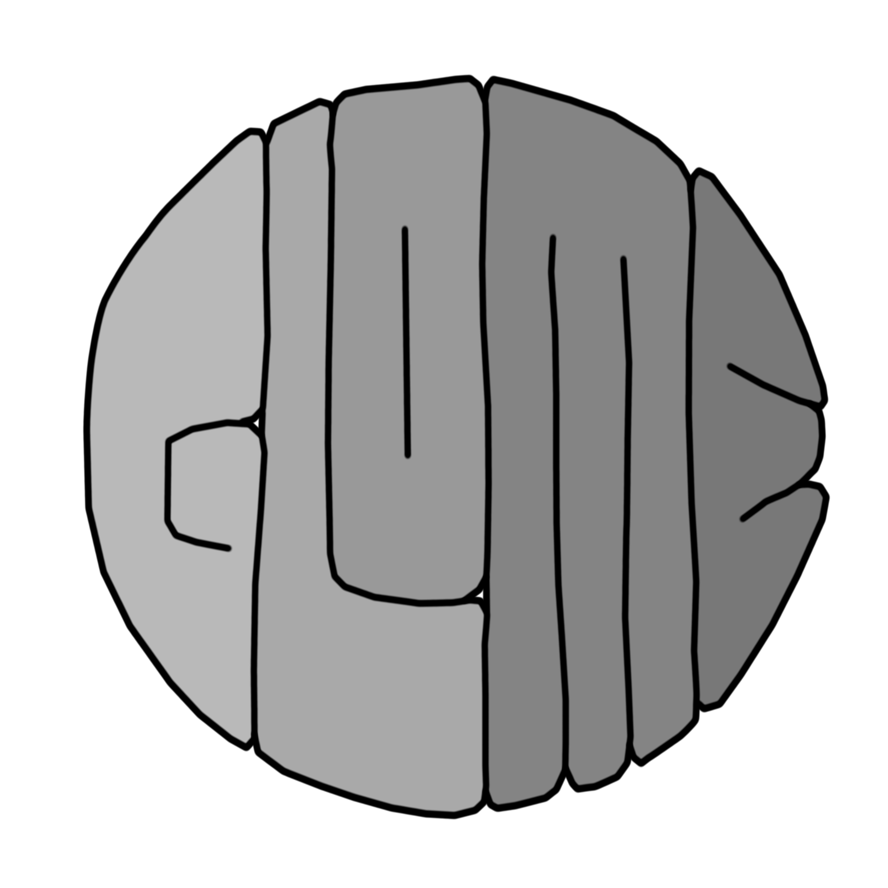
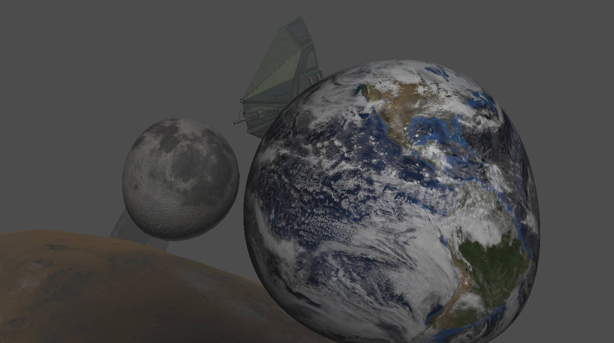

<div align="center">


**Renders 3D objects in the surface of a hypersphere.**


</div>

##### Download:
with [Git](https://git-scm.com/):
```
git clone https://github.com/tsoj/glome.git
```

##### Compile
```
cd glome/
cmake .
make
```
##### Run:
```
./glome
```

##### Controls:

AWSDQE for roll, pitch and yaw.  
Arrow keys and PgUp, PgDown for lateral movement.

###### More in [`about.pdf`](./about.pdf)

